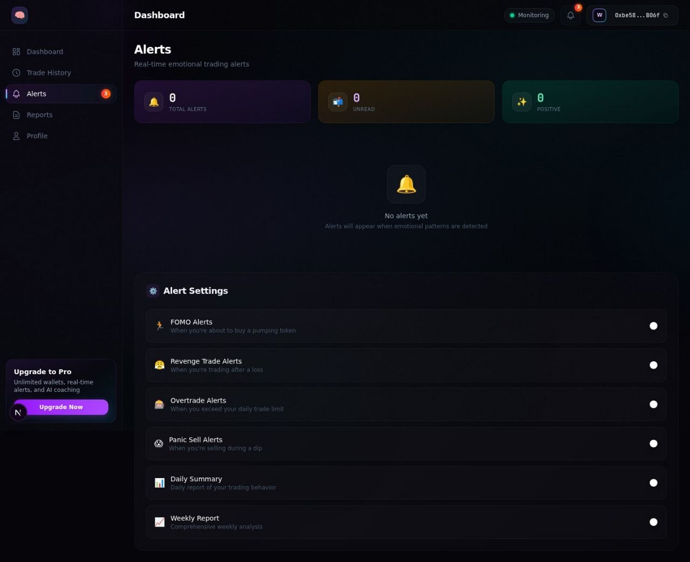
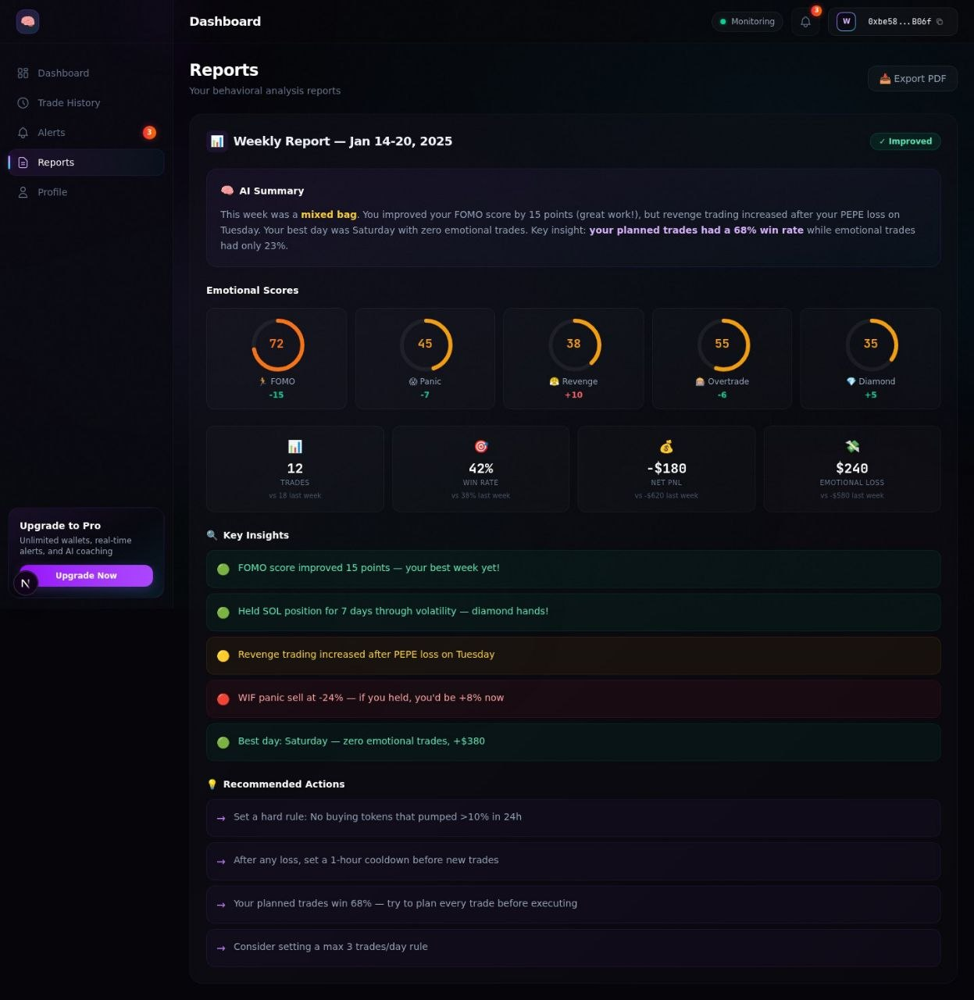
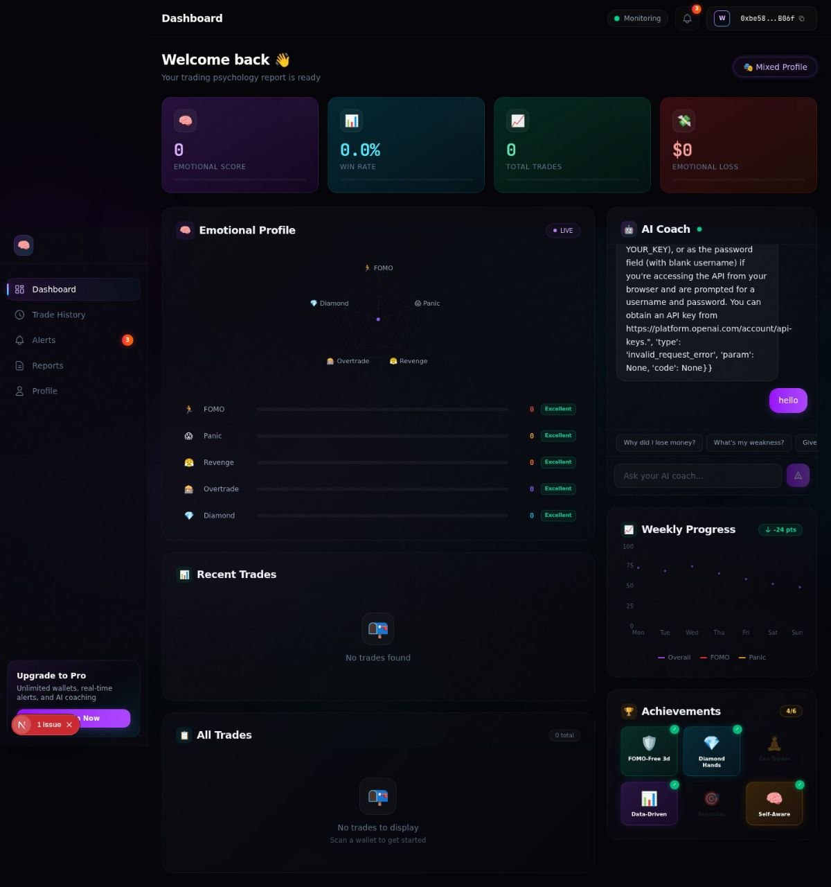
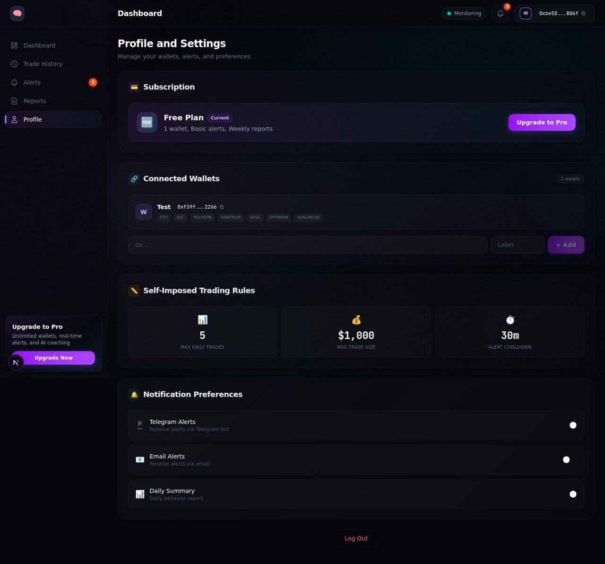
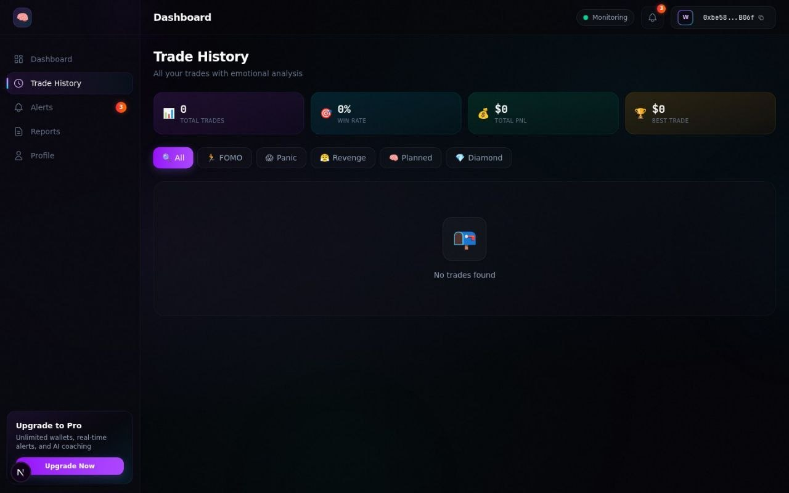

# 🧠 Crypto Therapist — AI Trading Psychologist

<p align="center">
  <strong>Analyze your wallet. Understand your emotions. Trade better.</strong>
</p>

<p align="center">
  <a href="#-features">Features</a> •
  <a href="#-tech-stack">Tech Stack</a> •
  <a href="#-getting-started">Getting Started</a> •
  <a href="#-api-endpoints">API</a>
</p>

---

## 📖 Overview

**Crypto Therapist** is an AI-powered trading psychologist that analyzes your on-chain wallet data to detect emotional trading patterns. It scans your transaction history, identifies behavioral biases like FOMO, Panic Selling, Revenge Trading, and Overtrading, then provides personalized AI coaching to help you become a more disciplined trader.

### What It Does

1. **Connect or paste any wallet address** — supports Ethereum, BSC, Polygon
2. **Deep behavioral analysis** — scans 400+ trades to detect emotional patterns
3. **Emotional profiling** — quantifies FOMO, Panic, Revenge, Overtrade, Diamond Hands scores
4. **Personality classification** — categorizes you as a trader type (e.g., "Reactive FOMO Trader")
5. **AI Coach** — chat with an AI that understands YOUR trading psychology and gives actionable advice
6. **Trade history** — detailed breakdown of every trade with emotion tags and hold times
7. **Weekly progress** — track your emotional score improvement over time
8. **Achievements** — gamified badges for trading milestones

---

## ✨ Features

### 🎯 Dashboard
- Real-time emotional score (0-100)
- Win rate and total trades overview
- Emotional loss calculator (how much you lost to emotional decisions)
- Personality type with detailed breakdown

### 🧠 Emotional Radar
- **FOMO Detector** — identifies trades made from fear of missing out
- **Panic Detector** — flags panic sells during dips
- **Revenge Detector** — catches revenge trades after losses
- **Overtrade Detector** — detects excessive trading frequency
- **Diamond Hands Score** — measures conviction and patience

### 🤖 AI Coach
- Powered by GPT-5.5 model
- Context-aware — knows your wallet history and emotional profile
- Suggested prompts: "Why did I lose money?", "What's my weakness?", "Give me a rule"
- Real-time chat with typing indicators

### 📊 Trade History
- Full transaction log with emotion tags per trade
- Chain detection (ETH, BSC, Polygon)
- DEX detection (Uniswap, PancakeSwap, SushiSwap, etc.)
- PnL tracking with percentage gains/losses
- Hold time analysis

### 🔐 Authentication
- Sign-In with Ethereum (SIWE) — no passwords, just wallet signature
- JWT-based session management
- Public scan available without authentication

### 🔔 Alerts (Coming Soon)
- Real-time emotional trading alerts
- WebSocket-based notifications
- Email and Telegram alert channels

---

## 🛠 Tech Stack

### Frontend
| Technology | Purpose |
|------------|---------|
| **Next.js 16** | React framework with App Router |
| **TypeScript** | Type safety |
| **Tailwind CSS** | Utility-first styling |
| **RainbowKit** | Wallet connection UI |
| **wagmi** | Ethereum hooks for React |
| **viem** | TypeScript interface for Ethereum |
| **Recharts** | Charts and data visualization |
| **React Query** | Server state management |
| **shadcn/ui** | UI component library |

### Backend
| Technology | Purpose |
|------------|---------|
| **FastAPI** | High-performance Python API |
| **SQLAlchemy** | ORM and database toolkit |
| **PostgreSQL** | Primary database |
| **Redis** | Caching and session store |
| **Alembic** | Database migrations |
| **Celery** | Background task processing |
| **httpx** | Async HTTP client |
| **JWT (jose)** | Token authentication |

### AI & Blockchain
| Technology | Purpose |
|------------|---------|
| **GPT-5.5** | AI coaching model (via OpenGateway) |
| **Etherscan API** | On-chain transaction data |
| **eth-account** | Ethereum signature verification |
| **SIWE** | Sign-In with Ethereum standard |

---

## 🚀 Getting Started

### Prerequisites
- Python 3.11+
- Node.js 18+
- PostgreSQL 15+
- Redis 7+

### Backend Setup

```bash
# Clone the repo
git clone https://github.com/centreaoti-commits/lavra-project.git
cd lavra-project

# Backend setup
cd backend
python -m venv venv
source venv/bin/activate
pip install -r requirements.txt

# Configure environment
cp .env.example .env
# Edit .env with your:
# - DATABASE_URL
# - REDIS_URL
# - AI_BASE_URL and AI_API_KEY
# - ETHERSCAN_API_KEY (optional)

# Run migrations
alembic upgrade head

# Start server
uvicorn app.main:app --host 0.0.0.0 --port 8000 --reload
```

### Frontend Setup

```bash
cd frontend
npm install

# Configure environment
cp .env.example .env.local
# Edit .env.local with your:
# - NEXT_PUBLIC_API_URL (backend URL)
# - NEXT_PUBLIC_WALLETCONNECT_PROJECT_ID

# Start development server
npm run dev
```

### Docker Setup (Optional)

```bash
docker-compose up -d
```

---

## 📡 API Endpoints

### Authentication
| Method | Endpoint | Description |
|--------|----------|-------------|
| `GET` | `/auth/nonce` | Get SIWE nonce |
| `POST` | `/auth/verify` | Verify SIWE signature, get JWT |

### Analysis
| Method | Endpoint | Description |
|--------|----------|-------------|
| `POST` | `/analysis/scan/{address}` | Full wallet scan (auth required) |
| `POST` | `/analysis/scan/public/{address}` | Public scan (no auth) |
| `GET` | `/analysis/{address}` | Get cached analysis |

### Trades
| Method | Endpoint | Description |
|--------|----------|-------------|
| `GET` | `/trades/{address}` | Get trades (auth required) |
| `GET` | `/trades/public/{address}` | Get trades (no auth) |
| `GET` | `/trades/stats/{address}` | Trade statistics |

### Chat (AI Coach)
| Method | Endpoint | Description |
|--------|----------|-------------|
| `POST` | `/chat/send` | Send message to AI coach (auth) |
| `POST` | `/chat/public` | Chat with AI coach (no auth) |
| `GET` | `/chat/history` | Get chat history |

### User
| Method | Endpoint | Description |
|--------|----------|-------------|
| `GET` | `/user/profile` | Get user profile |
| `PUT` | `/user/profile` | Update profile |
| `GET` | `/user/dashboard` | Dashboard data |

---

## 🧪 Testing

```bash
# Backend tests
cd backend
pytest tests/ -v

# Frontend lint
cd frontend
npm run lint
```

---

## 📁 Project Structure

```
lavra-project/
├── backend/
│   ├── app/
│   │   ├── api/                    # API routes
│   │   │   ├── analysis/           # Wallet analysis endpoints
│   │   │   ├── auth/               # SIWE authentication
│   │   │   ├── chat/               # AI coach chat
│   │   │   ├── trades/             # Trade history
│   │   │   ├── alerts/             # Alert system
│   │   │   ├── reports/            # Report generation
│   │   │   └── user/               # User management
│   │   ├── core/
│   │   │   ├── ai/                 # AI coach (GPT-5.5 integration)
│   │   │   ├── analysis/           # Emotion detectors
│   │   │   │   ├── fomo_detector.py
│   │   │   │   ├── panic_detector.py
│   │   │   │   ├── revenge_detector.py
│   │   │   │   ├── overtrade_detector.py
│   │   │   │   ├── diamond_hands.py
│   │   │   │   ├── personality.py
│   │   │   │   └── scoring.py
│   │   │   ├── blockchain/         # On-chain data fetching
│   │   │   └── alerts/             # Alert dispatchers
│   │   ├── models/                 # SQLAlchemy models
│   │   ├── schemas/                # Pydantic schemas
│   │   └── tasks/                  # Celery background tasks
│   ├── alembic/                    # Database migrations
│   ├── tests/                      # Test suite
│   └── requirements.txt
├── frontend/
│   ├── src/
│   │   ├── app/
│   │   │   ├── dashboard/          # Dashboard pages
│   │   │   │   ├── page.tsx        # Main dashboard
│   │   │   │   ├── history/        # Trade history
│   │   │   │   ├── alerts/         # Alerts page
│   │   │   │   ├── reports/        # Reports page
│   │   │   │   └── profile/        # User profile
│   │   │   ├── onboarding/         # First-time setup
│   │   │   └── page.tsx            # Landing page
│   │   ├── components/
│   │   │   ├── dashboard/          # Dashboard widgets
│   │   │   │   ├── emotional-radar.tsx
│   │   │   │   ├── stats-bar.tsx
│   │   │   │   ├── trades-table.tsx
│   │   │   │   ├── trade-timeline.tsx
│   │   │   │   ├── ai-coach-chat.tsx
│   │   │   │   ├── weekly-progress.tsx
│   │   │   │   └── achievement-badges.tsx
│   │   │   ├── landing/            # Landing page sections
│   │   │   ├── layout/             # Layout components
│   │   │   ├── providers/          # Context providers
│   │   │   ├── shared/             # Shared components
│   │   │   └── ui/                 # UI primitives
│   │   ├── hooks/                  # Custom React hooks
│   │   └── lib/                    # Utilities
│   ├── public/                     # Static assets
│   └── package.json
├── docs/plans/                     # Development plans
├── docker-compose.yml
└── MASTER_PLAN.md
```

---

## 🎨 Screenshots

### Landing Page


### The Problem


### Features


### Pricing


### Dashboard


---

## 🗺 Roadmap

- [x] Wallet analysis and emotional profiling
- [x] AI coaching with GPT-5.5
- [x] Trade history with emotion tags
- [x] SIWE authentication
- [x] Public wallet scan (no auth required)
- [ ] Real-time WebSocket alerts
- [ ] Email/Telegram alert channels
- [ ] Multi-wallet portfolio analysis
- [ ] Historical emotional score tracking
- [ ] Community leaderboards
- [ ] Mobile app (React Native)
- [ ] API for third-party integrations

---

## 📄 License

MIT License — see [LICENSE](LICENSE) for details.

---

<p align="center">
  Built with 🧠 by <a href="https://github.com/centreaoti-commits">centreaoti-commits</a>
</p>
